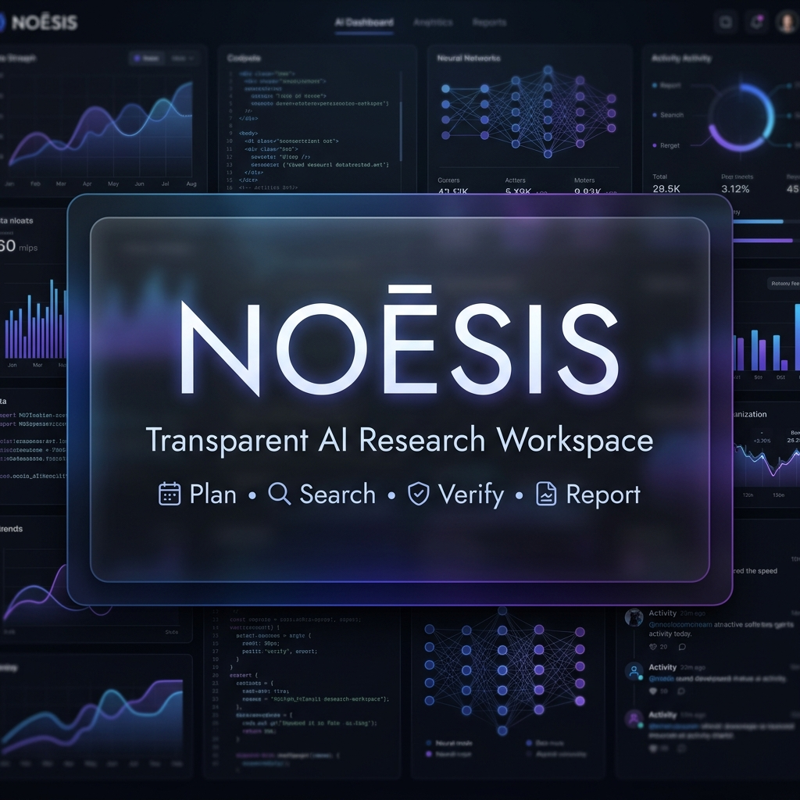
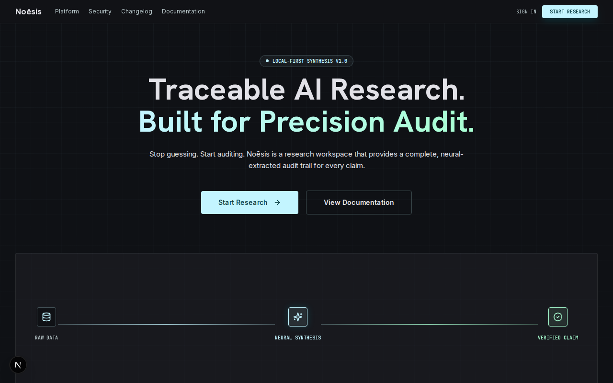
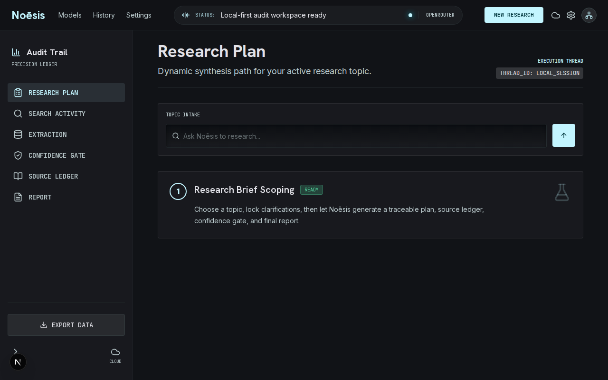
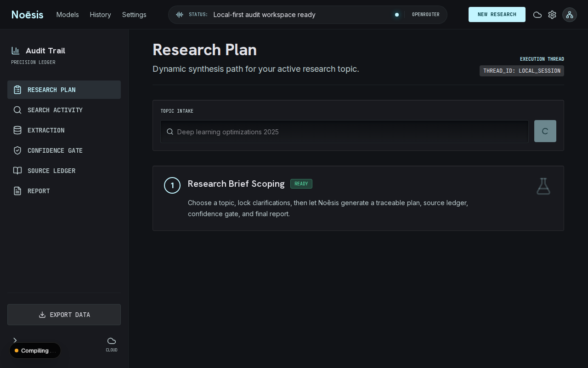
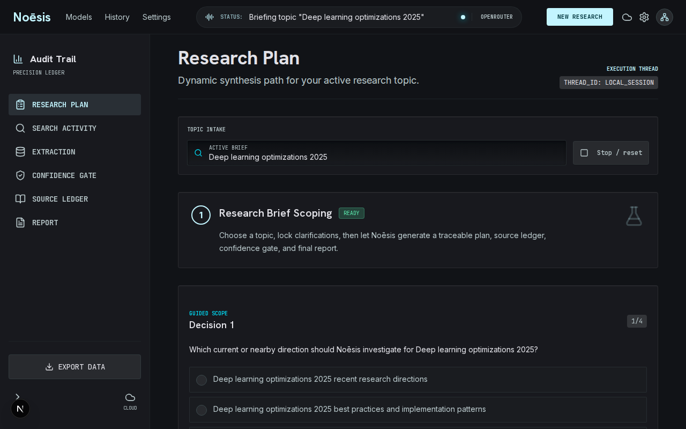
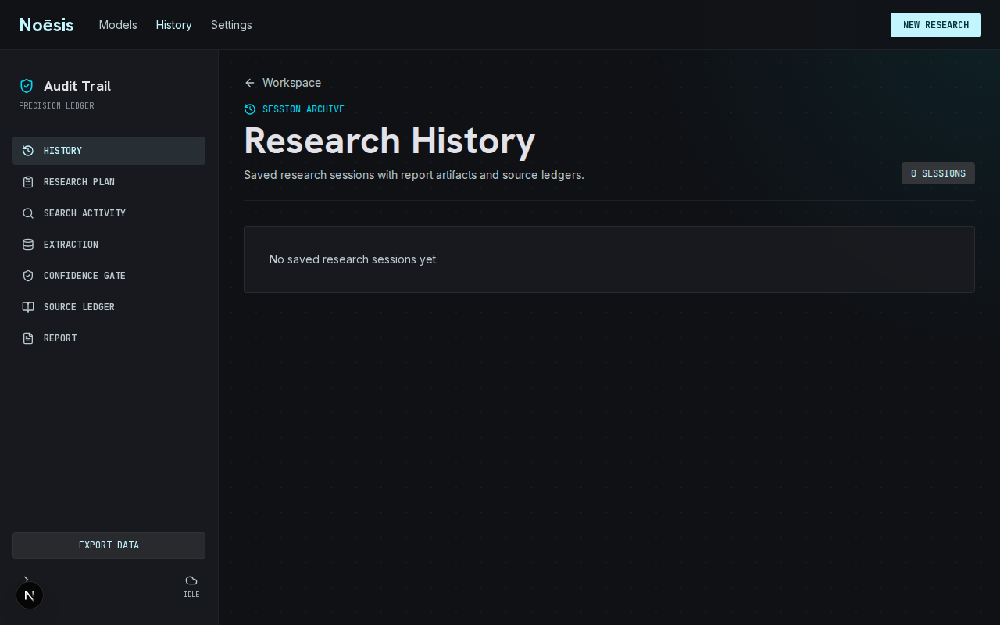
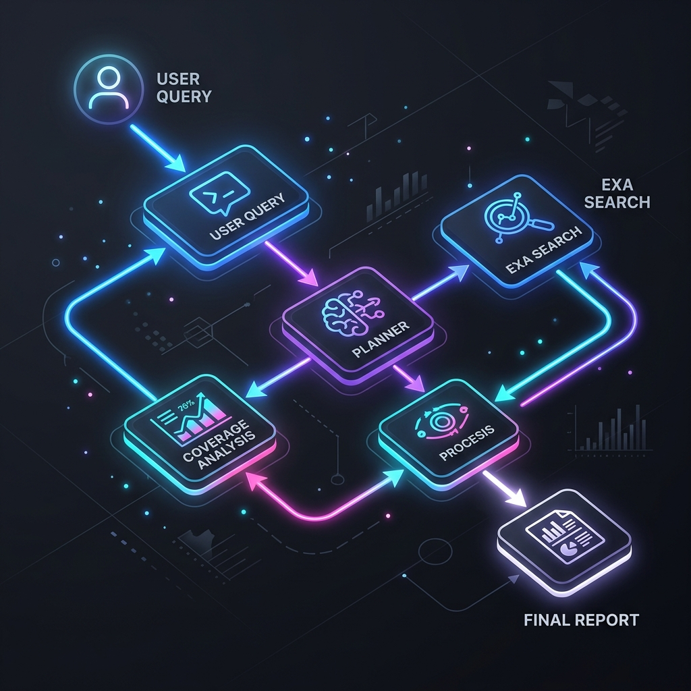

<div align="center">
  

  <h1>Noēsis</h1>

  <p><strong>AI-powered Deep Research Workspace that plans, searches, verifies, and generates citation-backed reports with a transparent research pipeline.</strong></p>

  <p>
    <a href="#">Live Demo</a> •
    <a href="#architecture">Architecture</a> •
    <a href="#local-setup">Documentation</a> •
    <a href="#">Report Example</a> •
    <a href="#">Portfolio</a>
  </p>
</div>

<br/>

## Why Noēsis?

Traditional LLMs produce answers but hide their reasoning.

Noēsis makes AI research transparent by exposing every stage:
- **Query Planning**
- **Source Discovery**
- **Coverage Analysis**
- **Confidence Evaluation**
- **Report Generation**

Every research session is fully auditable.

---

## ✨ Features

- **✅ Deep Research**
- **✅ Streaming Research Pipeline**
- **✅ Source Ledger**
- **✅ Markdown Export**
- **✅ Session History**
- **✅ Anonymous Authentication**
- **✅ Local-first Persistence**
- **✅ Production-ready Postgres**
- **✅ Rate Limiting**
- **✅ AI Model Switching**
- **✅ Audit Trail**

---

## 🛠 Tech Stack


---

## 📸 Product Screenshots

<div align="center">
  
  <p><em>Landing Page</em></p>

  
  <p><em>Research Workspace</em></p>

  
  <p><em>Live Pipeline Execution</em></p>

  
  <p><em>Generated Markdown Report</em></p>

  
  <p><em>Session History</em></p>

  
  <p><em>System Architecture</em></p>
</div>

---

<h2 id="architecture">🏗 Architecture</h2>

### 📁 Repository Structure

```text
Noesis
├── Frontend
│   ├── app/
│   │   ├── api/
│   │   ├── workspace/
│   │   ├── report/
│   │   └── history/
│   ├── components/
│   └── store/
├── AI Engine
│   └── lib/ai/
├── Research Pipeline
│   └── api/deep-research/
├── Persistence Layer
│   └── lib/session-store.ts
├── Export Service
│   └── api/exports/
├── Session Manager
│   └── lib/session-owner.ts
└── Deployment
    └── Vercel / Neon
```

### 🔄 Research Pipeline

```text
       User Query
           │
           ▼
  Clarifying Questions
           │
           ▼
    Research Planner
           │
           ▼
       Web Search
           │
           ▼
     Deduplication
           │
           ▼
   Coverage Analysis
           │
           ▼
    Confidence Gate
           │
           ▼
      Final Report
           │
           ▼
    Markdown Export
```

### 🤖 AI Workflow

User submits topic
↓
LLM generates research plan
↓
Planner creates search queries
↓
Exa retrieves documents
↓
Sources deduplicated
↓
Coverage checked
↓
Missing information researched
↓
Report generated
↓
Report stored
↓
Markdown exported

---

## ⚡ Performance

- **✓ Streaming responses**
- **✓ Incremental rendering**
- **✓ Route-safe state persistence**
- **✓ Cached session loading**
- **✓ Local-first fallback**
- **✓ Lazy loading**
- **✓ Optimistic UI**

---

## 🧗 Engineering Challenges

- **Streaming AI responses without UI freezing:** Implemented careful chunking and React state batching.
- **Session persistence:** Built a resilient store falling back to local storage when Postgres is unavailable.
- **Route-safe streaming:** Ensured the AI stream isn't interrupted or lost during Next.js client-side navigation.
- **Duplicate source removal:** Robust hashing and URL normalization for Exa search results.
- **Confidence scoring:** Used a specialized evaluator LLM pass to gate the report generation.
- **Anonymous multi-session users:** Implemented HTTP-only visitor cookies to securely link multiple sessions without forced signups.
- **Local-first storage:** Allows developers to run the entire app without a database using `.noesis/sessions.json`.
- **Production database fallback:** Seamlessly switches to Neon Postgres in production environments.

---

## 🚀 Production Ready

- **✓ Rate limiting**
- **✓ Error boundaries**
- **✓ Retry logic**
- **✓ Health endpoint** (`/api/health/db`)
- **✓ Environment validation**
- **✓ Persistent storage**
- **✓ Export service**
- **✓ Anonymous authentication**
- **✓ Responsive UI**

---

## 📊 Statistics

- **20+ API endpoints**
- **8 AI pipeline stages**
- **100% TypeScript**
- **Streaming architecture**
- **Anonymous session management**
- **Markdown export**
- **Production deployment**

---

<h2 id="local-setup">💻 Local Setup</h2>

Install dependencies:
```bash
npm install
```

Create `.env.local`:
```bash
cp .env.local.example .env.local
```

Add keys:
```env
OPENROUTER_API_KEY=
EXA_SEARCH_API_KEY=
DATABASE_URL=
BLOB_READ_WRITE_TOKEN=
NEXT_PUBLIC_APP_URL=http://localhost:3000
```
> `DATABASE_URL` is optional locally. When empty, sessions use `.noesis/sessions.json`.

Run locally:
```bash
npm run dev
```

---

## 🔮 Roadmap

- Multi-agent research
- PDF export
- Team workspaces
- Citation verification
- Graph knowledge extraction
- Voice research
- Research sharing

---

## ⭐️ Social Proof

If you found this project useful or interesting, please **⭐ Star the repository**! It helps a lot.
